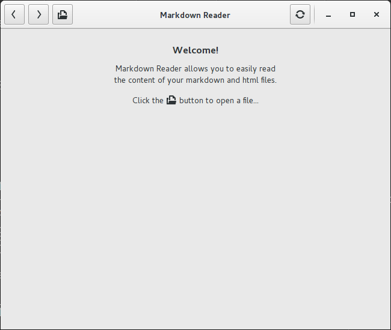
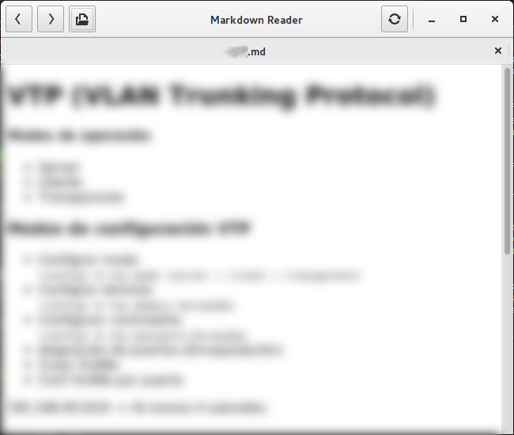
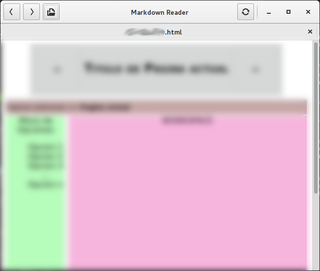
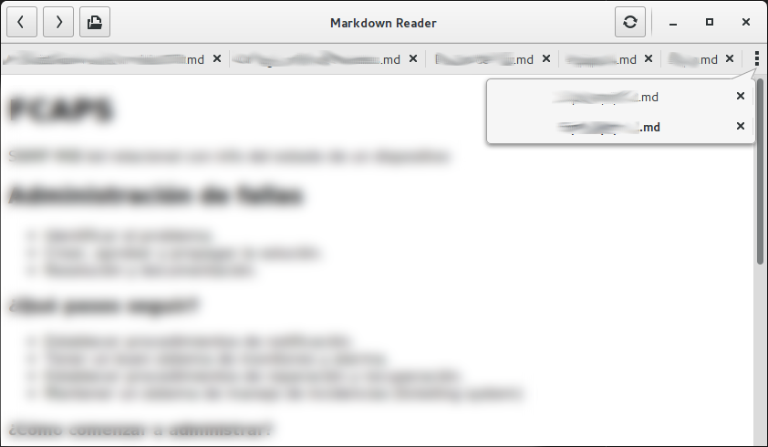

# Markdown Reader
A document reader for markdown and html files.

Compiling: `$ ./configure && make`  
Installing: `# make install`

### Main view

### HTML Support

### Multiple files (tab support)
